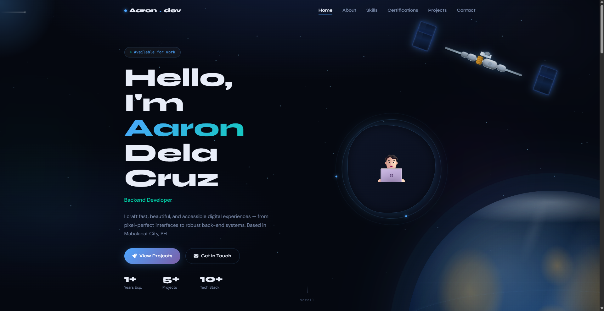

# Aaron Dela Cruz — Space Portfolio

> A space-themed personal portfolio with a scroll-driven satellite, realistic CSS Earth, particle systems, and smooth section animations. Built with **vanilla HTML, CSS, and JavaScript** — zero frameworks, zero build tools required.



---

## 📁 Project Structure

```
aaron-portfolio/
├── index.html              # Main entry point
│
├── css/
│   ├── base.css            # Design tokens, reset, utilities, buttons
│   ├── space.css           # Globe, satellite, particles, nebula, stars
│   └── sections.css        # Navbar, hero, about, skills, projects, contact, footer
│
├── js/
│   ├── utils.js            # Math helpers (lerp, clamp, easeInOutCubic…)
│   ├── scroll.js           # Scroll tracker & active-section detection
│   ├── animation.js        # Satellite path + particles + scroll-reveal
│   └── main.js             # Boot — wires all modules together
│
├── assets/
│   ├── images/
│   │   └── og-image.png    # Open Graph / social share image (1200×630)
│   ├── icons/
│   │   ├── favicon.svg
│   │   ├── favicon-32.png
│   │   ├── apple-touch-icon.png
│   │   └── site.webmanifest
│   └── fonts/              # Self-hosted font fallbacks (optional)
│
└── docs/
    ├── ARCHITECTURE.md     # Codebase decisions & module map
    ├── DEPLOYMENT.md       # GitHub Pages, Netlify, custom domain setup
    ├── CUSTOMISATION.md    # How to edit colours, content, satellite path
    └── CHANGELOG.md        # Version history
```

---

## 🚀 Quick Start

No build step needed — just open the file.

```bash
# Clone
git clone https://github.com/aaron-delacruz/aaron-portfolio.git
cd aaron-portfolio

# Option 1: open directly
open index.html

# Option 2: local dev server (recommended — needed for ES modules)
npx serve .
# or
python3 -m http.server 8080
```

> **Note:** ES `import`/`export` requires a server (even `file://` won't work in most browsers). Use `npx serve .` or VS Code Live Server.

---

## ✏️ Personalising Content

All personal content lives in **`index.html`**. Search for the following placeholders and replace them:

| Placeholder | Replace with |
|---|---|
| `Aaron Dela Cruz` | Your full name |
| `ronkydc@gmail.com` | Your email address |
| `https://github.com/ron-cd` | Your GitHub Pages URL |
| `https://github.com/ron-cd` | Your GitHub profile |
| `linkedin.com/in/aaron-dela-cruz-99734a30b/` | Your LinkedIn URL |
| `Mabalacat City, PH` | Your location |
| `assets/Aaron-Dela-Cruz-CV.pdf` | Your CV file path |
| Project titles, descriptions, links | Your actual projects |

### Changing colours

Open `css/base.css` and edit the `:root` block:

```css
:root {
  --clr-accent:   #4da6ff;   /* primary blue accent */
  --clr-accent-2: #7b5ea7;   /* purple accent */
  --clr-accent-3: #00d4aa;   /* teal accent */
  --clr-bg:       #050810;   /* page background */
}
```

### Changing the satellite path

Open `js/animation.js` and edit `_waypoints`:

```js
_waypoints: [
  { p: 0.00, x: 0.88, y: 0.10, rot:  20 },  // Hero — top right
  { p: 0.20, x: 0.55, y: 0.06, rot: -15 },  // About
  { p: 0.40, x: 0.08, y: 0.40, rot: -80 },  // Skills
  { p: 0.60, x: 0.12, y: 0.75, rot: -60 },  // Projects
  { p: 0.80, x: 0.82, y: 0.70, rot:  50 },  // Contact
  { p: 1.00, x: 0.50, y: 0.92, rot:   0 },  // Footer — middle bottom
],
```

`x` and `y` are fractions of viewport width/height (0.0–1.0). `rot` is the tilt in degrees.

---

## 🌐 Deployment

See **[docs/DEPLOYMENT.md](docs/DEPLOYMENT.md)** for full instructions. Quick version:

### GitHub Pages

```bash
git init
git add .
git commit -m "Initial commit"
git remote add origin https://github.com/YOUR_USERNAME/aaron-portfolio.git
git push -u origin main
```

Then in GitHub → Settings → Pages → Source: **Deploy from branch** → `main` / `/ (root)`.

Your site will be live at `https://YOUR_USERNAME.github.io/aaron-portfolio/`.

### Netlify (drag & drop)

1. Go to [netlify.com](https://netlify.com)
2. Drag the `aaron-portfolio/` folder onto the deploy zone
3. Done — live in 30 seconds

---

## ♿ Accessibility

- Semantic HTML5 (`<header>`, `<nav>`, `<section>`, `<article>`, `<footer>`)
- All decorative elements have `aria-hidden="true"`
- Interactive elements have visible focus styles
- `aria-label` on all icon-only buttons
- `aria-live="polite"` on the carousel
- Respects `prefers-reduced-motion`
- Colour contrast ratio ≥ 4.5:1 for all text

---

## 🔒 Security

- All external links use `rel="noopener noreferrer"`
- Font Awesome loaded via CDN with **SRI hash** (`integrity=` attribute)
- No cookies, no tracking, no third-party scripts beyond fonts + icons
- Content Security Policy header recommended — see `docs/DEPLOYMENT.md`
- No `eval()`, no `innerHTML` with user data

---

## ⚡ Performance

- No frameworks, no bundler — single HTTP request per asset
- Fonts loaded with `preconnect` + `display=swap`
- Animations use only `transform` and `opacity` (GPU-composited layers)
- `will-change: transform` only on the satellite
- `IntersectionObserver` for lazy scroll-reveal
- `requestAnimationFrame` + passive scroll listeners
- Canvas particles scale down on mobile (55 vs 110)

---

## 🗺️ Browser Support

| Browser | Version |
|---|---|
| Chrome / Edge | 90+ |
| Firefox | 88+ |
| Safari | 14+ |
| Mobile Safari | iOS 14+ |
| Samsung Internet | 14+ |

ES Modules (`type="module"`) are required. No IE11 support.

---

## 📄 Licence

MIT — free to use, modify, and distribute. Attribution appreciated but not required.

---

## 👤 Author

**Aaron Dela Cruz**  
[github.com/aaron-delacruz](https://github.com/ron-cd) · [linkedin.com/in/aaron-delacruz](https://www.linkedin.com/in/aaron-dela-cruz-99734a30b)
